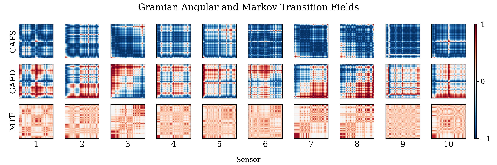

# CNN classification from EEG timeseries data transformed to images
This repository holds the code for the final project for Data Science, Prediction, and Forecasting (S2024). This includes preprocessing of EEG data, converting the timeseries from the sensors to Gramian Angular & Markow transitional fields, and the training and testing 3D convolutional neural networks on the data.




## Project overview

| Directory               | Description |
|---------------------------|-------------|
| `data/`                   | Contains the preprocessed EEG data and data converted to images.|
| `fig/`                    | Visualisations used in the paper. |
| `results/`                | Dictionary with results for each model for each participant|
| `src/`                    | Scripts used to preprocess, convert timeseries to images and fit models. |
| `utils/`                  | Module with functions and classes for CNN and converting timeseries to images |

## Setup
Before running any code, create a virtual environment and install the required packages within it using the following command:
```
setup_env.sh
```

As the data is not publicly available, the full pipeline cannot be run directly. However, by providing you own data and modifying the script for initial preprocessing of the EEG data (`src/preprocess.py`) the rest of the pipeline can be utilised. 


## Usage
Activate the virtual environment
```
source env/bin/activate
```

Preprocess the data:
```
python src/preprocess.py # initial preprocessing of EEG data
python src/timeseries2gaf.py # convert the timeseries to GAFs and MTFs
```

Fit models
```
python src/fit_individual_cnn.py # fit the individual CNNs 
python src/fit_joint_cnn.py # fit the joint CNN on training participants
python src/finetune_joint.py # finetune the joint CNN to test participants
```

Evaluating and visualisation
```
python src/eval_models.py
python src/plot_results.py
```


Alternatively, the pipeline can be by using the provided bash script
```
run_all.sh
```